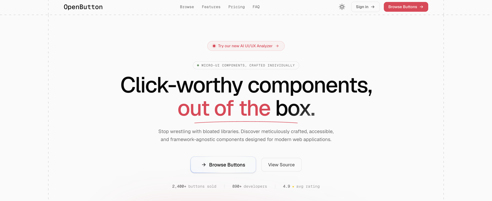

<div align="center">
  
  <h1 align="center">
    
  </h1>
  <p align="center">
    <b>Elevate your digital presence with state-of-the-art interactive UI and AI-driven design intelligence.</b>
  </p>
</div>

---

## ⚡ Click-Worthy Components, Out of the Box.
**Open Button** is a curated ecosystem of ultra-premium, production-ready React components designed to make your application look like a $10M+ tech startup instantly. Say goodbye to plain, boring UI and hello to state-of-the-art skeuomorphic, glassmorphism, and neon-layered aesthetics.

### 🌟 What We Offer

* **💎 Premium UI Components:** High-end, interactive buttons and UI elements built with React, Tailwind CSS, and Framer Motion. Ready to drop directly into your codebase.
* **🤖 AI UI/UX Audit:** Not sure what to upgrade? Enter your website URL, and our AI engine will perform a deep heuristic evaluation. We break down visual hierarchy, validate accessibility, and provide component-level upgrade recommendations.
* **🎨 Custom Design to Code Services:** Have a Figma file or a screenshot? We translate your custom designs into pixel-perfect, interactive code (React/Vue/HTML) starting at just ₹200, delivered within 48 hours.

---

## 🚀 Quick Start

Get the project running locally in seconds:

```bash
# Clone the repository
git clone https://github.com/samay-hash/openbutton.git

# Navigate into the project directory
cd openbutton

# Install dependencies (using pnpm)
pnpm install

# Start the development server
pnpm run dev
```
*Open [http://localhost:3000](http://localhost:3000) to view it in your browser.*

---

## ✨ Featured Aesthetics

Our component library focuses on top-tier design trends:
- **Layered Glass:** Skeuomorphic glowing edges with soft inner shadows.
- **Minimal Dark:** Sleek, high-contrast elements for modern SaaS platforms.
- **Shimmer Trace:** Subtle, dynamic metallic shines.
- **Ghost Sweep:** Clean, minimalist interactions with smooth gradient reveals.

---

## 🤝 Let's Build Together

Want a specific animation or a fully custom landing page? 
Visit our live platform, submit your requirements, and let us handle the code. We bridge the gap between world-class design and flawless frontend execution.

<div align="center">
  <sub>Built with ❤️ by the Open Button Team</sub>
</div>

